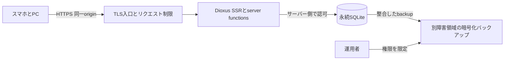

# TSUNORUの初回公開計画

調査日: 2026-09-05。対象: main `06e57c1`。PR: https://github.com/velengel/tsunoru/pull/7

## 提案と前提

最初の候補は、既存Dioxusサーバーを有料の小規模ホストで動かし、SQLiteを永続ディスクに置く構成とする。
候補サービスはRenderとし、契約前に下記の試験を通す。
Cloudflareだけで完結させる場合はWorkers Static AssetsとD1への移植を別途評価する。
大規模移行は目的から導かれる場合にだけ行う。

初回の仮定は知人での試用、URLを知る参加者は登録不要、単一リージョン、短いメンテナンス停止を許容すること。
ユーザーには公開対象と費用上限を確認中であり、この仮定を承認済み要件とは扱わない。
公開URLを配る範囲が狭くても、APIへの攻撃は防げない。
機密の予定や個人情報の入力を前提にせず、共有相手からの再共有も起こり得ることを表示する。

## 現状の根拠

| 領域 | 確認できたこと | 公開への影響 |
| --- | --- | --- |
| 実行 | [Cargo.toml](../../Cargo.toml)、[main.rs](../../src/main.rs)はDioxus 0.7.10、Axum、TokioのFullstack | 静的ファイルだけでは作成と回答が動かない |
| DB | [storage.rs](../../src/storage.rs)のDATABASE/open_fileは相対パス `var/tsunoru.sqlite3`、WAL、外部キー、接続5件、起動時migration | マウントと作業ディレクトリの一致が必要。設定可能な絶対パスと起動検査が候補 |
| 整合性 | 同ファイルのcreate_event_record、create_event_continuation_by_session等はtransactionを使う。migrationsは0001〜0007 | D1へSQLだけコピーして互換と判断しない |
| 認証 | [auth.rs](../../src/auth.rs)のSessionCookiePolicy/public_origin_for_host、[ADR 0015](../ADR/0015-keep-account-history-optional-and-server-session-bound.md) | 任意アカウント、Argon2id、DB session、Secure/HttpOnly/SameSite、Origin検査が存在 |
| 公開前の不足 | ADR 0015はprocess内試行制限の公開前強化を要求 | TLSを付けるだけでは公開条件を満たさない |
| 主催権限 | [ui.rs](../../src/ui.rs)のread_organizer_capability/store_organizer_capabilityはlocalStorage | DB移転と権限移転は別。originや端末変更で失われる |
| 入力 | [domain.rs](../../src/domain.rs)は候補20件、名前100文字、コメント500文字等を制限 | 総イベント数、回答件数、通信量、試行回数の制限とは別 |
| UI | [既存のブラウザー検証](0019-calendar-browser-verification.md)は320px/1440px等の証拠 | 今回の公開版や実機iPhoneの合格証拠には流用しない |

## 構成の比較

| 選択肢 | 残せる部分と変更 | DBと運用 | 判断 |
| --- | --- | --- | --- |
| Render等のネイティブサーバー＋永続SQLite | Dioxus、SQLx、認証を維持。配布と公開設定を追加 | 単一instance、外部バックアップ、デプロイ停止を許容 | 初回の第一候補。費用と復元試験を条件にする |
| Workers Static Assets＋Worker API＋D1 | UIやdomainの再利用を試す。server functions、SQLx、認証計算とtransactionの適合確認が必要 | binding経由、batchの原子性、Time Travelを評価 | Cloudflare必須、費用、運用負担が移植費を上回るなら別spike |
| Pages＋外部API | UI配置とAPIを分離。cookie、CORS、SSR、バージョン整合が増える | 外部DB/サーバーは結局必要 | 初回は採らない。分離の利益がまだない |
| Cloudflare Containers | Rustバイナリを動かせるが、既存ローカルDB永続化は別問題 | ディスクはephemeral。Durable Objectの永続領域はSQLiteファイルのマウントではない | 初回は採らない。外部DBを足す理由が弱い |
| 自宅Mac＋Tunnel | 手元構成を公開できても、電源、回線、個人DB、運用が結び付く | 個人環境の可用性に依存 | 常用公開には採らない |

Cloudflareは新規プロジェクトにWorkers Static Assetsを推奨している（S1）。
WorkersのRustはWasm向けであり、現行native serverを無変更で実行できるという意味ではない（S2とコードからの判断）。
D1のbatchは失敗時にrollbackできるが、既存のread→Rustで分岐→writeというtransactionの置換には個別設計が必要（S4）。

## 公開時のデータと権限

静的assets以外のAPIと個人情報を含むHTMLは共有キャッシュへ載せない。
主催capability、回答capability、account sessionを別の権限として扱う。
共有URLや表示名だけで主催操作を認めない。
アカウント履歴があることは主催capabilityを持つ証明にならない。

| 攻撃または故障 | 公開前に要求する検証 | 初回の扱い |
| --- | --- | --- |
| Cookie盗難、CSRF | 正規HTTPSでlogin/logout/期限切れを確認。異origin、Origin欠落、偽造Host、直接originアクセスを負例にする | `TSUNORU_PUBLIC_ORIGIN`を固定し、入口とappで境界を検証 |
| 越権アクセス | A/Bのイベント、回答、sessionを取り違えた読込と更新を拒否。公開projectionにcapability/hashが出ない | 既存認可を移植せず維持し、配布版で回帰試験 |
| XSSと秘密漏えい | 投稿内容、SSR、HTML/ICS、ログ、Referer、エラー応答に秘密が出ない | CSPをDioxusの実行方式に合わせて検証。外部解析タグは入れない |
| 総当たりと資源枯渇 | 登録/login、匿名作成/回答の連打、巨大body、総件数、並列Argon2を試す | 入口とappの制限、429、上限到達時の入力保持を公開前に実装 |
| データ公開範囲の誤認 | 共有URL、回答後matrix、カレンダーが誰に見えるか説明と実装を照合 | URLを秘密認証と誤説明しない。アクセス制御が必要なら別設計 |
| 権限紛失 | 新端末、localStorage拒否、cookie削除、パスワード紛失を操作 | 回復できない範囲を明記。安全な回復方式は別Issue候補 |
| ディスク消失と破損 | 再起動、再デプロイ、disk不足、復元後の権限と関係整合を試す | 復元未検証なら公開しない |

入口の信頼設定を決める前に `X-Forwarded-For` 等を無条件で信用しない。
Cloudflareを入口に足す場合は、別ドメインのorigin直アクセスでも同じ防御が効くことを検証する。
Turnstileは攻撃が観測された場合の追加候補であり、認可や件数制限を置き換えない。
管理用cloudアカウントはMFAと最小権限を使い、PR previewに本番DBや本番secretを渡さない。

## DBと移行

初回は空の本番DBを作る案を既定とする。
手元データの移行はユーザーが必要と判断した場合だけ行う。
ローカルの実データ、ブラウザーstorage、secretを今回読み取ったり公開したりしていない。

移行が必要なら、書込みを止め、SQLite backup APIで整合したsnapshotを作り、複製上でmigrationと復元を試す（S9）。
WAL中の `.sqlite3` 単体コピーをbackupとして扱わない。
schema version、件数、`integrity_check`、`foreign_key_check`、回答集計、決定、履歴を照合する。
別originにはcookieとlocalStorageが移らないので、sessionは再login、旧主催権限は自動移行できないものとして個別判断する。
移行ツールやcapabilityのexport/importを無条件に作らない。

運用者は復元手順を実行し、暫定目標をRPO 24時間、RTO 4時間として計測する。
別障害領域へ日次backupを置き、アクセスを限定し、保持は暫定7世代とする。
ホストのディスクsnapshotだけでDB整合性が保証されたと扱わない。
DB schema変更前にはbackupを取り、旧binaryとの互換がない場合はwrite停止とDB復元を伴うrollbackにする。
単に旧アプリを再デプロイしてschemaまで戻るとは考えない。

## スマホの公開判定

- 320/375/390pxとdesktopで作成→URL共有→別browserの匿名回答→主催集計→決定→ICS取得を通す。
- 候補20件、長い名前、長文コメント、未回答/多数回答でページ全体が横にはみ出さない。matrix内の意図した横scrollは許容する。
- 日付を読み違えずタップできる。WCAG 2.2の24 CSS px最低条件または間隔例外を測り、主要操作は44px程度を設計目標にする。数値だけで操作性合格としない（S10）。
- 実機iPhone SafariとAndroid Chromeで、キーボード表示、戻る、共有、clipboard代替、ICS、遅い通信、連打、再送、保存失敗を確認する。
- キーボードのみ、focus表示、200%拡大、VoiceOverでの名前と状態を確認する。送信失敗時に入力を失わない。
- レイアウト全刷新、PWA、push通知、ネイティブアプリは初回に作らない。失敗した主要導線だけ修正する。

## 実施順と完了条件

| 段階 | 次に行う作業 | 完了条件と中止条件 |
| --- | --- | --- |
| 0 計画 | このPRで比較、敵対的検証1回、修正1回 | 計画の根拠と残件を記録して終了。実装や契約はしない |
| 1 配布の小実験 | 別実装PRで固定toolchain、release bundle、Linuxイメージ、health/readiness、DB path設定 | 使い捨てDBで起動→作成→再起動→読込。失敗時は構成を再評価。原則1作業日を上限の目安にする |
| 2 公開前の防御と復元 | 認証/入口、制限、backupと復元、運用文書 | 上記負例、復元演習、必須cargo/dx検証がPASS。criticalな漏えい/データ消失は保留で公開しない |
| 3 スマホから試用 | 分離stagingで実機導線と公開URL設定を確認 | 利用者1組が作成から決定まで完了。失敗時はその導線だけ修正 |
| 4 限定公開 | 費用、ドメイン、保持方針、停止手順を確定し本番反映 | HTTPS、再起動保持、backup、監視、公開範囲説明が確認できてから共有 |
| 5 利用後判断 | エラー率、回答完了率、待ち時間、費用を確認 | 要求が出たものだけ別Issueへ。無条件に全面移行しない |

各実装PRは利用者から観測できる失敗を先に試し、必要な修正を行う。
アプリ変更時はリポジトリ指定のcargo test両構成、clippy、fmt、dx buildを実行する。
成功したローカルテスト、公開環境のHTTP、実機確認は別の証拠として保存する。
Linux検証ツールの既知R017は、実際に使う場合だけ別Issueで再評価する。

## 費用と分岐

Renderは有料computeと永続diskが必要（S6/S7）。
見積はcompute＋disk容量＋転送超過＋backup保存/転送＋ドメインを含める。
無料プランのephemeral filesystemに本番SQLiteを置く案は採らない。
固定の金額は契約直前に最新料金表と選択リージョンで確認する。
この調査は契約見積や購入承認を兼ねない。

無料必須なら、必要な防御を省く代わりにWorkers/D1案の移植コストを見積もる。
Cloudflare内完結が必須なら、最小の作成と回答だけでD1 transaction、Wasm認証計算、SSR/RPCを検証し、成功するまで全面移植を開始しない。
高可用性や複数instanceが必要になれば、SQLite単一diskを続ける条件を外し、Postgres等を再比較する。

## 今回、別Issue、実施しない

| 判断 | 対象 | 理由と着手条件 |
| --- | --- | --- |
| 今回 | 計画、根拠、敵対的検証と修正 | このPRの成果物 |
| 次の公開実装 | 配布小実験、公開前の防御、DB復元、スマホ主要導線 | 公開目的に直接必要。段階1〜4で分割する |
| 別Issue候補 | 主催権限の端末間移行と紛失回復 | 必要性はあるが、本人確認を伴う独立設計。単なるURLコピーで解決しない |
| 別Issue候補 | アカウント回復、セルフサービス削除、イベント期限 | 初回の保持/削除運用を決めたうえで、利用者需要から自動化 |
| 別Issue候補 | Workers/D1移植spike | Cloudflare必須、費用または運用上の根拠が出た場合のみ |
| 実施しない | 全員へのOAuth必須化、UI全刷新、通知、PWA、分析基盤、複数region | 初回の予定調整を成立させる必要条件ではない |

「別Issue候補」は未作成であり、完了扱いではない。
採用構成が未確定の段階で大量にIssueを起票しない。
公開前必須の不具合を別Issueに移しただけで公開条件を満たしたとは扱わない。

## 調査資料

一次資料を仕様根拠に使う。
公開事例はS8のDioxus公式配布例とS6の永続ディスク構成例を参照した。
TSUNORUそのもののCloudflare稼働成功事例は確認していない。
類似サービスの記事を互換性の証拠にはしない。

| ID | 資料 | 確認した事項 |
| --- | --- | --- |
| S1 | [Workers best practices](https://developers.cloudflare.com/workers/best-practices/workers-best-practices/) | 新規はWorkers Static Assets推奨 |
| S2 | [Workers Rust](https://developers.cloudflare.com/workers/languages/rust/) | workers-rsとWasm実行 |
| S3 | [Containers lifecycle](https://developers.cloudflare.com/containers/concepts/architecture/) | container diskの非永続性 |
| S4 | [D1 Database API](https://developers.cloudflare.com/d1/worker-api/d1-database/) | binding、batch、失敗時rollback |
| S5 | [D1 limits](https://developers.cloudflare.com/d1/platform/limits/) / [Time Travel](https://developers.cloudflare.com/d1/reference/time-travel/) | 復元保持期間はプランに依存。無料7日、有料30日 |
| S6 | [Render disks](https://render.com/docs/disks) | 有料disk、単一instance、deploy停止、DB用backupの必要 |
| S7 | [Render pricing](https://render.com/pricing) / [Free limitations](https://render.com/docs/free) | computeとdisk等の課金要素、無料disk不可 |
| S8 | [Dioxus 0.7 bundle](https://dioxuslabs.com/learn/0.7/tutorial/bundle/) | release bundle、containerのlisten address |
| S9 | [SQLite Online Backup](https://www.sqlite.org/backup.html) | 稼働DBの整合したbackup方法 |
| S10 | [WCAG target size](https://www.w3.org/WAI/WCAG22/Understanding/target-size-minimum.html) | 24px最低条件と例外 |
| S11 | [OWASP Session](https://cheatsheetseries.owasp.org/cheatsheets/Session_Management_Cheat_Sheet.html) | TLS、cookie、sessionの保護 |
| S12 | [OWASP CSRF](https://cheatsheetseries.owasp.org/cheatsheets/Cross-Site_Request_Forgery_Prevention_Cheat_Sheet.html) | Origin検証と多層防御 |

## 検証状態

コードと公式資料の照合は実施済み。
初版 `dcae200` にローカルの敵対的検証を1回行い、下記を1バッチで修正した。
第三者監査、侵入試験、hosted Codexの承認とは区別する。
このPRでアプリコード、DB、cloud設定は変更していない。
Linux配布、外部公開、実機操作、backup復元、負荷と攻撃への耐性はUNVERIFIED。

## 敵対的検証後の補足

### 防御の合格条件

段階2の暫定値はbody上限64 KiB、イベントごとの回答上限100件、保存イベント総数100件とする。
匿名作成は信頼できるclient単位で10回/時、回答は60回/分から評価し、login/registerは既存制限も残す。
これらは試用の提案値であり、実装済み仕様でも承認済み要件でもない。
同じ回線の参加者への誤制限と、上限時の案内を確認して確定する。
正規Originを偽装する任意HTTP clientでも連打できるため、CSRF対策だけで攻撃を防いだとしない。

入口のclient情報の信頼仕様を確認し、直接originアクセスや偽造headerで制限を回避できないことを負例で証明する。
できなければapp側の永続的な全体予算と容量上限で資源を制限し、公開方式を再検討する。
入口を含む防御がapp再起動で消えないことを確認する。
Cloudflareを使わない構成にも同じ条件を課す。

使い捨てstagingで20同時利用を5分間試し、書込み消失/重複/部分保存0件、通常操作p95 2秒以内、429/413で入力保持、制限時も既存予定を読めることを暫定基準とする。
タイムアウト後の再送で二重保存されるなら、操作単位の重複防止を公開前修正に含める。
この試験は大規模利用への保証ではない。
CSP、Referrer-Policy、frame制限、cache bypassは実応答で確認し、eval等を使う現行UIの動作と安全性を両方評価する。

### 復元と削除の責任

公開前に運用者、問い合わせ先、保存期間、削除依頼の権限確認と実行手順を決める。
試用は暫定30日とし、終了時に削除か継続同意を確認する。
期間と窓口が未決なら実データの受付を開始しない。
セルフサービス削除を後回しにしても、運用者による権限確認付き削除と記録は公開条件に含める。
表示名だけで削除や権限再発行を認めない。

backup復元はlogoutや削除より前の状態を戻し得る。
復元後は旧account sessionを全失効し、backup以降の削除を運用記録から再適用してからwriteを再開する。
capability漏えい事故では、対象イベントの無効化またはcapability更新が済むまでアクセスを再開しない。
削除データはbackup保持期間まで残ることを説明し、復元による再公開を防ぐ。
運用記録には生tokenや不要な投稿内容を残さない。

backupにschema version、アプリcommit、日時、検証結果を付ける。
外形HTTP失敗、5xx、DB容量、backup最終成功時刻を監視する。
backup未成功24時間または容量80%超で通知し、容量上限前に新規受付を止められる手順を持つ。
通知先と対応者を公開前に確定する。監視基盤の自作は不要。

### 費用と範囲の確定条件

料金表は閲覧したが、取得本文からcomputeとdiskの単価を確認できなかった。月額はUNVERIFIEDとする。
契約前の見積票にcompute、disk、backup、転送、ドメイン、税と合計を記載し、予算上限と比較する。
最小compute候補は公式の `0.5c-512mb`（旧starter）だが、0.5 CPU/512 MBでの実用負荷は未検証（[compute plans](https://render.com/docs/compute-plans)）。
予算や負荷が合わなければ自動で購入/増強せず、構成比較へ戻る。

セルフサービス回復、OAuth、Workers移植、Linux harness R017は未実装のまま残す。
段階1の配布小実験が成功した時点で、段階2〜3を実装Issueへ分割する。
R017はLinuxで既存harnessを使う必要が出た場合だけ再現し、アプリ起動試験と区別する。
判断履歴は[レビュー判断ログ](../review-judge-logs.md#pr-7-公開計画の敵対的検証1往復)に置く。
